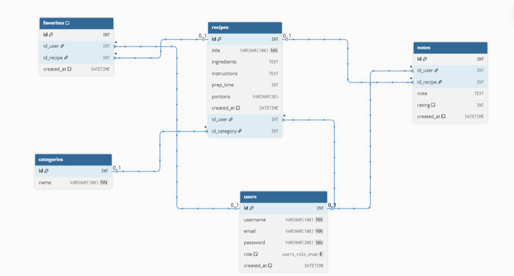
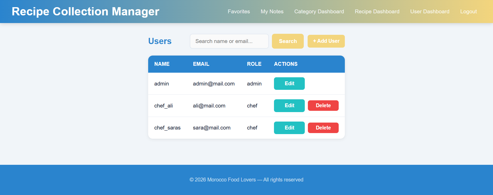

# Recipe Collection Manager

## Overview

Recipe Collection Manager is a web-based platform developed for **Marrakech Food Lovers** to help users organize, manage, and explore their personal recipes in one centralized system.

The application solves the problem of scattered recipes (paper notes, phone photos, documents) by providing a structured and searchable platform.

The system follows **MVC architecture**, uses **Object-Oriented Programming (OOP)** principles, and relies on a **MySQL relational database** with secure authentication via **PHP sessions** and **password hashing**.

---

## Features

### 👨‍🍳 Chef (User) Access
- User registration and login.
- Create, edit, and delete personal recipes.
- View all personal recipes with details:
  - Title
  - Ingredients
  - Instructions
  - Preparation time
  - Portions
- Organize recipes by categories.
- Add recipes to **favorites** ⭐.
- Add **notes and ratings (1–5 stars)** 📝.
- Filter recipes by category.

### 👑 Admin Access
- Full user management:
  - Create users
  - Edit users
  - Delete users (with restrictions)
- Secure role-based system (admin / chef).
- Dashboard redirection and control.

---

## Installation

### Prerequisites
- Git
- XAMPP (Apache + MySQL)
- PHP 8+

---

### Steps

1. **Start XAMPP**
   - Open XAMPP Control Panel
   - Start Apache and MySQL

2. **Clone the repository**
```bash
cd C:\xampp\htdocs
git clone https://github.com/BEN-ESSAHRAOUI-Yassine/Recipe_Collection_Manager_PRJ.git
```
3. **Import the database**
-   Open phpMyAdmin.
-   Create a database surf_school.
-   Import the schema.sql file from the config folder.
4. **Configure the project**

Open config/database.php and set your database credentials:
```bash
$host = "localhost";
$dbname = "recipe_repo";
$username = "root";
$password = "";
```
5. **Access the project**

Open your browser and go to:
```bash
http://localhost/Recipe_Collection_Manager_PRJ/public/
```
---
## Technologies Used

- PHP 8+ (Core PHP with PDO for database access)
- MySQL (Relational database with foreign keys)
- HTML5, CSS3 (Responsive design)
- XAMPP (Apache server & MySQL)
- Git (Version control)
- PHP Sessions (Authentication)
- Password Hashing (password_hash / password_verify)
- MVC Architecture & OOP (Encapsulation with private/public properties)
- Role-Based Access Control (Admin / chef)
---

## Directory Structure

```
└── 📁app
    └── 📁controllers
        ├── AdminController.php
        ├── AuthController.php
        ├── CategoryController.php
        ├── DashboardController.php
        ├── FavoriteController.php
        ├── NoteController.php
        ├── RecipeController.php
    └── 📁core
        ├── BaseController.php
        ├── database.php
        ├── Security.php
    └── 📁models
        ├── Category.php
        ├── Favorite.ph
        ├── Note.php
        ├── Recipe.php
        ├── User.php
    └── 📁views
        └── 📁admin
            ├── user_form.php
            ├── users.php
        └── 📁auth
            ├── login.php
            ├── register.php
        └── 📁Category
            ├── add_category.php
            ├── list_category.php
        └── 📁favorite
            ├── list.php
        └── 📁layouts
            ├── footer.php
            ├── header.php
        └── 📁note
            ├── list.php
        └── 📁Recipe
            ├── add_recipe.php
            ├── edit_recipe.php
            ├── list_recipe.php
└── 📁config
    ├── database.php
    └── schema.sql
└── 📁public
    └── 📁assets
        └── 📁css
            ├── style.css
        └── 📁imgs
            ├── DB_Class_diagram.png
    └── index.php
```

---

## Security Measures

- Password hashing with `password_hash()` / `password_verify()`.
- Role-based access control (Admin vs Surfer).
- Prepared statements using PDO to prevent SQL injection.
- Input validation and sanitization.
- Session-based authentication.

---

## Usage Scenarios

### 👨‍🍳 User Workflow

1. Register a new account.
2. Log in.
3. Create recipes.
4. Organize recipes into categories.
5. Add recipes to favorites ⭐.
6. Add notes and ratings 📝.
7. Filter recipes by category.

### 👑 Admin Workflow

1. Log in as admin.
2. Access user dashboard.
3. Manage users:
    - Create / Edit / Delete
    - Control access and roles.

## Database Design

### DB Diagram




### Tables
- **users**: → stores user accounts and roles
- **recipes**: → stores recipe details
- **categories**: → stores recipe categories
- **favorites**: → stores favorite recipes per user
- **notes**: → stores ratings and notes per recipe

### Relationships

- One user → many recipes (1-N)
- One category → many recipes (1-N)
- One user → many favorites (1-N)
- One recipe → many notes (1-N)

- Foreign keys ensure referential integrity.

## Test Accounts

You can use the following pre-seeded accounts to test the application:

| Role      | email              | Password     |
| --------- | ------------------ | ------------ |
| Admin     | admin@mail.com     | adminpass    |
| Chef      | ali@mail.com       | chefpass     |
| Chef      | sara@mail.com      | chefpass     |

> ⚠️ These accounts are for development/testing purposes only.

## Notes

- Each user can only manage their own recipes.
- Admin cannot delete themselves.
- Favorites prevent duplicates using UNIQUE constraint.
- Notes allow rating from 1 to 5.

## Screenshots

### Dashboard



### Recipe list


### Add recipe


### Favorites page


### Notes page


### Admin panel


### Screenshot du board Jira final


